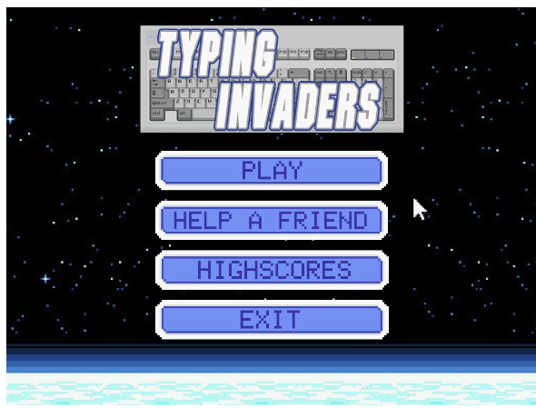
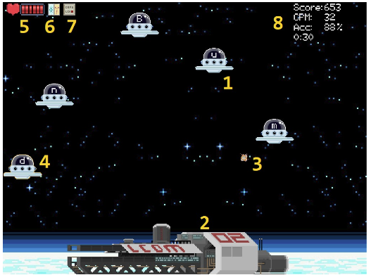
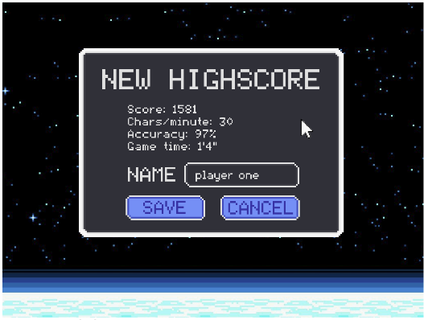
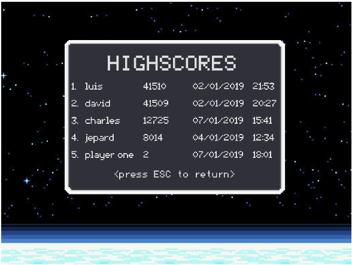
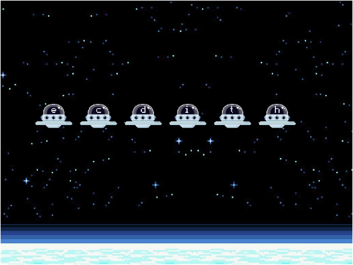

# LCOM Projects and Labs

**2017/2018** - 2nd Year, 1st Semester

**Course:** *Laboratório de Computadores* ([LCOM](https://sigarra.up.pt/feup/en/UCURR_GERAL.FICHA_UC_VIEW?pv_ocorrencia_id=419993)) | Computer Laboratory

**Authors:** David Silva ([daviddias99](https://github.com/daviddias99)), Luís Cunha ([luispcunha](https://github.com/luispcunha))

---

**Description:** During LCOM we were given lectures about programming different devices such as the mouse, keyboard, timer, etc.. On a bi-weekly basis we developed, in groups of 2, small examples of using these devices. The handouts for the lab sessions can be found [here](https://web.fe.up.pt/~pfs/aulas/lcom2018/labs.html) and the implementation of each lab can be found in the `labX` folders:

- Lab 2: PC's timer/counter
- Lab 3: The PC's Keyboard 
- Lab 4: PS/2 Mouse
- Lab 5: PC's video card in graphics mode 

For the final project (`proj` folder) we were challenged to create an application that would utilize the different devices and techniques learned during the theoretical and practical classes, aswell as other devices such as the RTC (real time clock) and the UART serial port. Our group created a cross between Space Invaders and a typing game called **Typing Invaders**. The game consists of a spaceship that shoots at invading aliens by typing the letters that appear on their spaceships. 

The game has **pixel colision** detection, different **power-ups** (freeze and multishot), **sprite drawing**, **animated sprites**, **highscore saving**.

The game makes use of the **timer** (game loop and framerate), **mouse** (for power ups and menu selection), **keyboard** (for playing and inserting high-score names), **real time clock** (tracking time and game events),** serial port** (multiplayer) and **video card** (game and menu display). 

A more detailed description of the project can be found in the report, `proj/doc` (it's in portuguese though).

The labs and project were developed on a Minix Virtual Machine and using a special library provided by the teachers (LCF) to deal with low level OS permissions and abstraction.

**Technologies:** C, x86 assembly

**Skills:** Low level programming, device programming (timer, mouse, keyboard, RTC, UART serial port, VBE), software modularity, game design, software program conception.

**Grade:** 19/20

---

Some images of the game:

